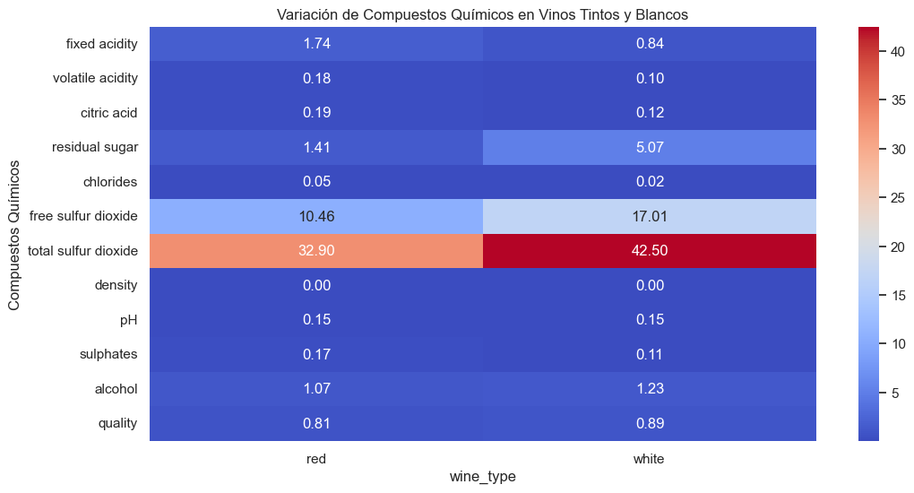
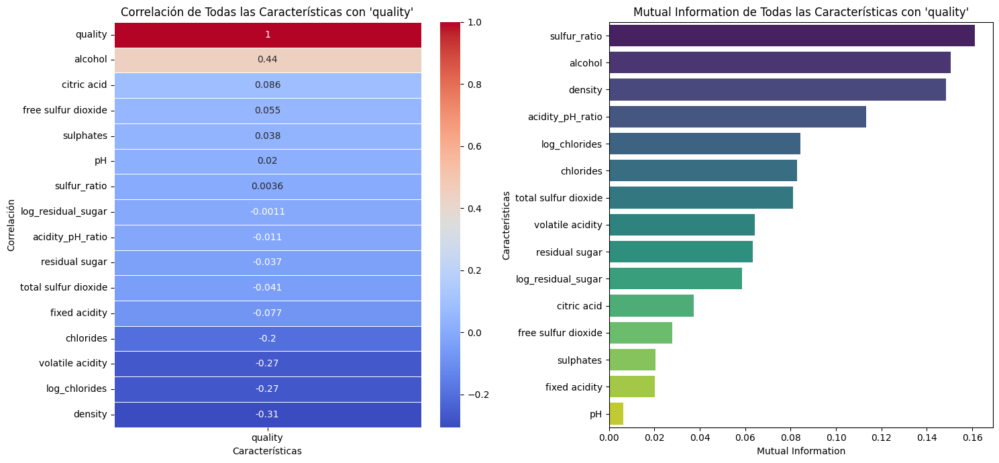
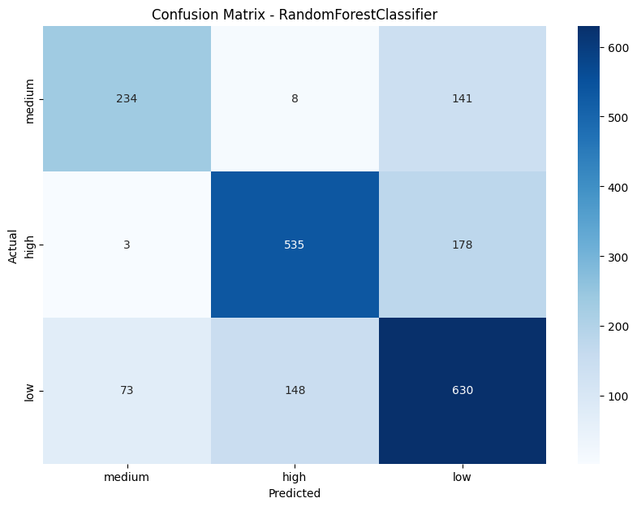
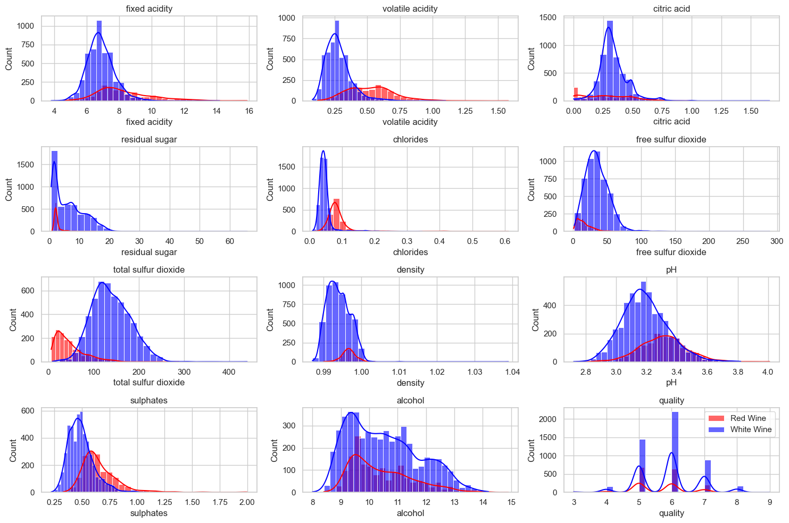

<p align="center">
    
</p>

# 🍷 Análisis de Calidad de Vinos

## 📌 Introducción

El análisis de la calidad del vino es un desafío clave en la industria vinícola, donde diversos factores fisicoquímicos influyen en la percepción sensorial de los consumidores. Este proyecto tiene como objetivo explorar, modelar y visualizar datos sobre vinos tintos y blancos de la región portuguesa **"Vinho Verde"**, utilizando técnicas de **ciencia de datos y machine learning** para comprender qué características impactan más en la calidad del vino.

A través de este estudio, se busca responder preguntas como:
- **¿Cuáles son los factores más influyentes en la calidad del vino?**
- **¿Es posible predecir la calidad de un vino a partir de sus propiedades químicas?**
- **¿Existen diferencias significativas entre vinos tintos y blancos?**
- **¿Cómo se pueden utilizar estos datos para optimizar la producción y selección de vinos?**

---

## 📊 Dataset

Este proyecto utiliza el dataset público **Wine Quality Dataset**, disponible en el **UCI Machine Learning Repository**. Los datos fueron recopilados por **Cortez et al. (2009)** y contienen **1599 muestras de vino tinto** y **4898 de vino blanco** con 11 atributos fisicoquímicos y una variable objetivo de calidad (score de 0 a 10).

### 🔹 **Atributos del dataset:**
- **Propiedades fisicoquímicas (input variables)**:
  1. Fixed acidity
  2. Volatile acidity
  3. Citric acid
  4. Residual sugar
  5. Chlorides
  6. Free sulfur dioxide
  7. Total sulfur dioxide
  8. Density
  9. pH
  10. Sulphates
  11. Alcohol

- **Variable objetivo (output variable)**:
  - **Quality**: Puntuación entre **0 (muy mala)** y **10 (excelente)** basada en la evaluación de expertos.

📂 **Archivos en el dataset:**
- `winequality-red.csv` → Vinos tintos (1599 muestras)
- `winequality-white.csv` → Vinos blancos (4898 muestras)

---

## 🏆 Objetivos del Proyecto

✅ Realizar un **análisis exploratorio de datos (EDA)** para identificar patrones y tendencias.  
✅ Aplicar **técnicas de machine learning** para predecir la calidad del vino.  
✅ Construir **visualizaciones avanzadas** para comunicar insights clave.  
✅ Implementar un **dashboard interactivo** para mostrar resultados.  
✅ Documentar todo el proceso.  

---

## 📌 Enfoque Metodológico

Este proyecto sigue un **flujo estructurado** basado en el proceso de **Ciencia de Datos**, incluyendo:

1️⃣ **Análisis exploratorio (EDA)** 📊  
   - Inspección y limpieza de datos.  
   - Visualización de distribuciones y correlaciones.  
   - Comparación entre vinos tintos y blancos.  

2️⃣ **Modelado Predictivo** 🤖  
   - Selección de características más relevantes.  
   - Entrenamiento de modelos como **Random Forest, XGBoost y SVM**.  
   - Evaluación del desempeño con métricas como **RMSE y F1-score**.  

3️⃣ **Desarrollo de Reporteria** 🌍  
   - Creación de un **dashboard interactivo** en Power BI.    

4️⃣ **Publicación y Presentación Profesional** 🚀  
   - Documentación clara con gráficos explicativos.  
   - Publicación en GitHub con un README detallado.  

---

## 📂 Estructura del Proyecto
```
📦 wine-quality-analysis
│── 📜 README.md  
│── 📜 requirements.txt  
│  
├── 📂 api/  
├── 📂 dashboard/  
├── 📂 data/  
│   ├── 📂 raw/  
│   │   ├── winequality-red.csv  
│   │   ├── winequality-white.csv  
│   │   ├── winequality.names  
│   │  
│   ├── 📂 processed/  
│   │   ├── X_train.csv  
│   │   ├── X_test.csv  
│   │   ├── y_train.csv  
│   │   ├── y_test.csv  
│  
├── 📂 models/  
│   ├── best_random_forest.pkl  
│  
├── 📂 notebooks/  
│   ├── EDA_Analysis.ipynb  
│   ├── Preprocessing.ipynb  
│   ├── Modeling.ipynb  
│  
├── 📂 reports/  
├── 📂 scripts/  
│   ├── download-dataset.py  
│   ├── load_data.py  
│   ├── load_processed_data.py  
│   ├── evaluate_model.py  


```
---

## 🔧 Tecnologías Utilizadas
✅ **Python** (Pandas, NumPy, Scikit-Learn, XGBoost)  
✅ **Jupyter Notebooks** para análisis interactivo  
✅ **Matplotlib, Seaborn, Plotly** para visualización 
✅ **Power BI** para reportes interactivos.
✅ **Git & GitHub** para control de versiones  

---

## 🔍 **Análisis Exploratorio de Datos (EDA)**  

📊 **Resultados clave:**  
- **El compuesto químico con mayor variación entre vinos tintos y blancos es el "Total Sulfur Dioxide"**, siendo considerablemente más alto en los vinos blancos. 

<p align="center">
    
</p>

- **La característica más correlacionada positivamente con la calidad del vino es el "Alcohol"**, lo que sugiere que vinos con mayor graduación alcohólica tienden a recibir mejores calificaciones.  
<p align="center">
    
</p>

- **La característica con mayor correlación negativa con la calidad es "Density"**, indicando que vinos más densos suelen tener menor calidad.  

---

## 🏗️ **Preprocesamiento de Datos**  

✔ **Normalización de características** con `StandardScaler`.  
✔ **Creación de nuevas características** como `sulfur_ratio`, `acidity_pH_ratio`, `log_residual_sugar`, `log_chlorides`.  
✔ **Conversión de la variable `quality` en una clasificación de 3 categorías:**  
  - **low**: Calidad baja (Nota entre 0 y 4)
  - **medium**: Calidad media (Nota entre 5 y 6) 
  - **high**: Calidad alta (Nota entre 7 y 10)

📊 **Distribución de la nueva variable objetivo:**  
- **low** 2384 
- **medium** 2836 
- **high** 1277 

---
## 🤖 **Resultados del Modelado**  

Se evaluaron diversos modelos de Machine Learning para la clasificación de la calidad del vino.

| Modelo         | Accuracy | Precision | Recall | F1-Score |
|---------------|----------|-----------|--------|----------|
| LinearSVC     | 0.58     | 0.58      | 0.58   | 0.56     |
| Decision Tree | 0.64     | 0.65      | 0.64   | 0.64     |
| Random Forest | 0.71     | 0.72      | 0.71   | 0.71     |
| XGBoost       | 0.71     | 0.72      | 0.71   | 0.71     |
| LightGBM      | 0.71     | 0.71      | 0.71   | 0.71     |
| MLPClassifier | 0.64     | 0.64      | 0.64   | 0.64     |

🔹 **El modelo con mejor desempeño fue Random Forest con 72% de Accuracy tras optimización con GridSearchCV.**

<p align="center">
    
</p>

---
## 🎯 **Conclusiones**  

### 🔹 **¿Cuáles son los factores más influyentes en la calidad del vino?**  
El análisis de correlación y mutual information identificó que:  
- ✔ **El contenido de alcohol** es el factor más positivamente correlacionado con la calidad del vino, lo que sugiere que vinos con mayor graduación alcohólica tienden a recibir mejores calificaciones.  
- ✔ **La densidad** es la variable con mayor correlación negativa con la calidad, indicando que vinos más densos suelen presentar menor calidad.  
- ✔ **El total de dióxido de azufre (Total Sulfur Dioxide)** varía significativamente entre vinos tintos y blancos, lo que podría impactar la percepción sensorial y la conservación del vino.  
- ✔ **Otras características**, como la acidez volátil y los sulfitos, también juegan un rol relevante en la evaluación de calidad.  

---

### 🔹 **¿Es posible predecir la calidad de un vino a partir de sus propiedades químicas?**  
Sí, logramos entrenar múltiples modelos de Machine Learning que permitieron predecir la calidad del vino con una precisión aceptable:  
- ✔ **El modelo más efectivo fue Random Forest**, el cual, después de optimización con GridSearchCV, alcanzó un **72% de precisión** en la clasificación de vinos en tres categorías: **"low", "medium" y "high"**.  
- ✔ **Modelos de ensamble como LightGBM y XGBoost** también demostraron desempeños similares, validando la capacidad predictiva de los datos químicos del vino.  
- ✔ **Los modelos de regresión lineal y SVM no lograron una precisión satisfactoria**, indicando que la relación entre las variables no es completamente lineal y requiere modelos más flexibles.  

---

### 🔹 **¿Existen diferencias significativas entre vinos tintos y blancos?**  

<p align="center">
    
</p>

Sí, el análisis exploratorio de datos reveló diferencias clave entre ambos tipos de vino:  
- ✔ **Los vinos blancos contienen una cantidad significativamente mayor de dióxido de azufre total**, lo que puede afectar su conservación y estabilidad.  
- ✔ **Los vinos tintos tienen mayor acidez fija y menor cantidad de azúcares residuales en comparación con los blancos.**  
- ✔ **La distribución de la calidad es diferente en ambos tipos de vino**, con una ligera tendencia de los vinos tintos a recibir calificaciones más altas.  

---

### 🔹 **¿Cómo se pueden utilizar estos datos para optimizar la producción y selección de vinos?**  
Los hallazgos obtenidos pueden ser utilizados en distintas etapas de la producción vinícola:  
- ✔ **Mejoras en el proceso de fermentación**: Dado que el contenido de alcohol está fuertemente correlacionado con la calidad, los productores pueden optimizar la fermentación para aumentar el grado alcohólico sin comprometer el perfil sensorial.  
- ✔ **Control de la composición química**: Regular la cantidad de sulfitos y acidez puede mejorar la percepción de calidad y reducir defectos en el vino.  
- ✔ **Automatización del control de calidad**: Los modelos de Machine Learning podrían implementarse en sistemas de evaluación de calidad para clasificar automáticamente los vinos en función de sus propiedades fisicoquímicas.  

---

## 📌 **Resumen Final:**  

- Este estudio ha demostrado que la calidad del vino está fuertemente influenciada por su composición química y que es posible predecirla con modelos avanzados de Machine Learning. Además, hemos identificado diferencias clave entre vinos tintos y blancos que pueden ser utilizadas para mejorar los procesos de producción y clasificación. 🚀🍷  
---
## 📌 Referencias
- **Cortez et al. (2009)** - Modeling wine preferences by data mining from physicochemical properties. *Decision Support Systems*. [DOI](http://dx.doi.org/10.1016/j.dss.2009.05.016)
- **UCI Machine Learning Repository** - [Wine Quality Dataset](https://archive.ics.uci.edu/dataset/186/wine+quality)
- Documentación de **Scikit-Learn** y **XGBoost**.

---

## 🚀 Siguientes Pasos
1. **Desarrollar una API o Dashboard interactivo.**
2. **Publicar el proyecto con documentación completa en GitHub.**

---

🔹 **Autor**: **Lumi Dev**  
🚀 _"Desarrollo que te impulsa"_  